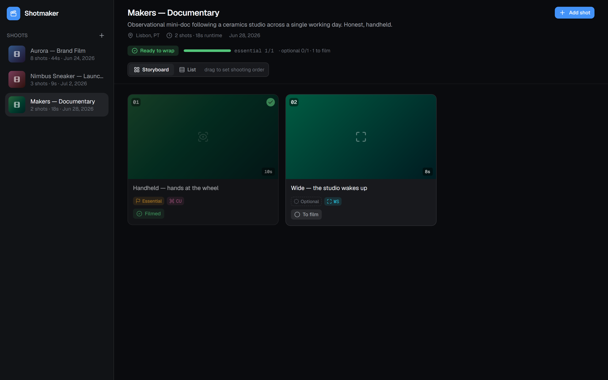

# Shotmaker

A **shoot-day shot tracker for production crews**. Keep tabs on **what to film first**, **what's already filmed or abandoned**, and **which shots actually matter** — so the crew always knows the plan and when the session can wrap.

> **Demo MVP.** Self-contained front-end demo: seeded mock data, local state, no backend or API keys. A from-scratch rework of the concept.


## The idea

On a shoot, the crew works through an ordered list of shots. Shotmaker tracks the three things that matter on the day:

- **Shooting order** — drag shots to decide what to film first.
- **Status** — mark each shot **To film → Filmed**, or **Abandoned** if it's dropped. Filmed shots get a check and dim out; abandoned shots are struck through.
- **Priority** — every shot is **Essential** or **Optional**. The session is **Ready to wrap** once all *essential* shots are filmed — optional shots are a bonus, not a blocker.

A per-session **readiness bar** shows essential progress (e.g. `essential 2/6`) and flips to **Ready to wrap** when the must-haves are done.

## Features

- **Storyboard & List views** — numbered shots (shooting order), priority + status badges, drag-to-reorder, one-tap status toggle.
- **Session readiness** — essential vs optional progress, with a clear "ready to wrap" state.
- **Shot detail panel** — status and priority controls, fields (type, movement, duration, lens, location), notes, plus a light AI assist to draft a shot description and suggest on-set facts (simulated stand-ins for the original Genkit flows).
- **Multiple sessions** — switch between shoots, each color-treated.

| Shot detail | Ready to wrap |
| --- | --- |
|  |  |

A short walkthrough is in [`media/video/shotmaker-walkthrough.webm`](media/video/shotmaker-walkthrough.webm).

## Tech stack

- **Next.js 16** (App Router) · **React 19** · **TypeScript**
- **Tailwind CSS 4** — "Clean Dark" theme (cool near-black canvas, single blue accent)
- **dnd-kit** (storyboard drag-and-drop) · **lucide-react** (icons)
- Simulated AI module in `src/lib/ai.ts` (stands in for the original Genkit flows)

## Run it

```bash
pnpm install
pnpm dev
```

Then open http://localhost:3000.

## Capture media

Screenshots and the walkthrough video are generated with Playwright:

```bash
pnpm build && pnpm exec next start -p 4060   # one shell
node capture.mjs                              # another
```

Output lands in `media/`.
