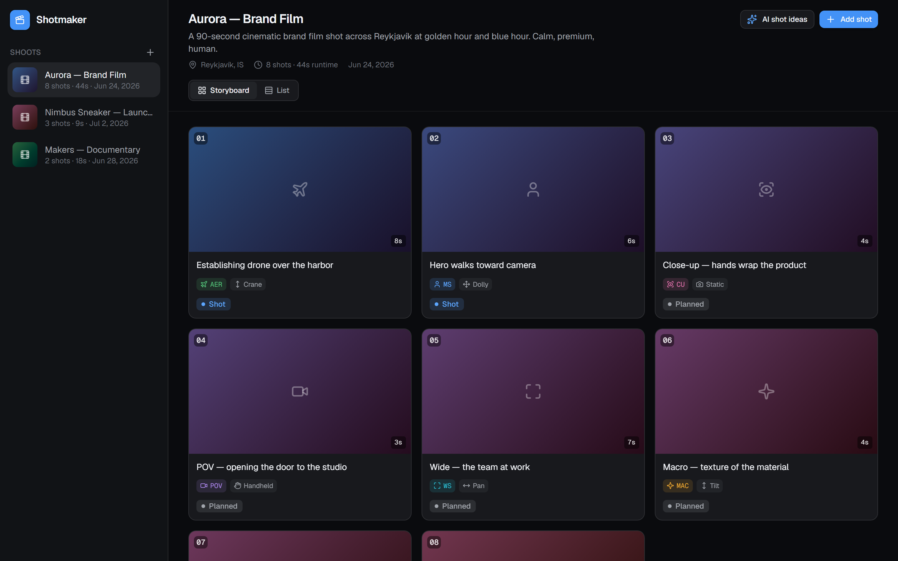
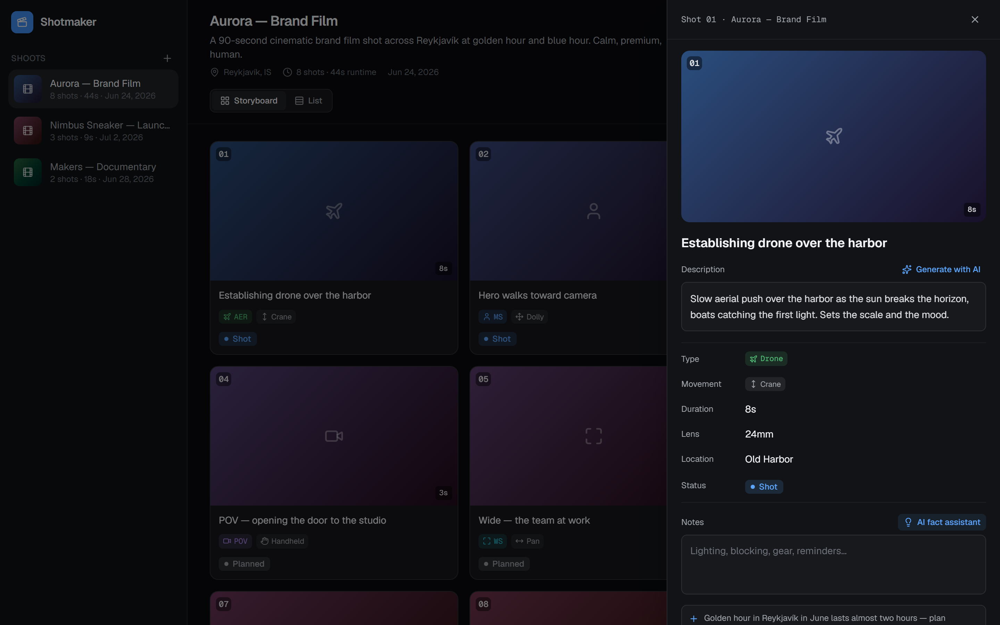
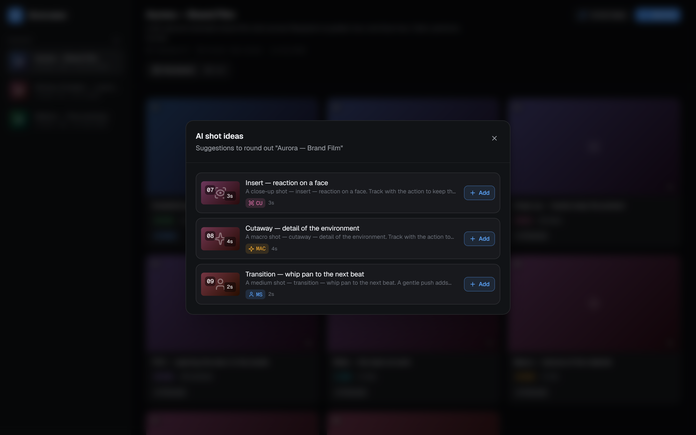

# Shotmaker

An **AI-assisted planner for video shoots**. Organize a production into sessions, build each session as a storyboard of shots, and let AI draft shot descriptions and on-set facts — then reorder everything with drag-and-drop.

> **Demo MVP.** Self-contained front-end demo: seeded mock data, local state, no backend or API keys. The AI features are simulated (canned, content-aware) stand-ins for the original Genkit flows. A from-scratch rework of the concept.



## Features

- **Storyboard** — a grid of cinematic shot frames (numbered, color-graded by shot type), with drag-to-reorder, type/movement chips, durations, and status.
- **List view** — the same shots as a dense, scannable shot list.
- **Shot detail panel** — description with one-click **AI generation**, fields (type, movement, duration, lens, location), click-to-advance status, notes, and an **AI fact assistant** that suggests on-set facts to insert.
- **AI shot ideas** — generates suggested shots to round out a session; add them with one click.
- **Multiple sessions** — switch between shoots, each with its own color treatment and runtime.

| Shot detail (AI) | AI shot ideas |
| --- | --- |
|  |  |

A short walkthrough is in [`media/video/shotmaker-walkthrough.webm`](media/video/shotmaker-walkthrough.webm).

## Tech stack

- **Next.js 16** (App Router) · **React 19** · **TypeScript**
- **Tailwind CSS 4** — "Clean Dark" theme (cool near-black canvas, single blue accent)
- **dnd-kit** (storyboard drag-and-drop) · **lucide-react** (icons)
- Simulated AI module in `src/lib/ai.ts` (stands in for the original Genkit flows)

## Run it

```bash
pnpm install
pnpm dev
```

Then open http://localhost:3000.

## Capture media

Screenshots and the walkthrough video are generated with Playwright:

```bash
pnpm build && pnpm exec next start -p 4060   # one shell
node capture.mjs                              # another
```

Output lands in `media/`.
